# CLARYON Architecture

Technical documentation for developers working on the CLARYON codebase.

---

## 1. Module Dependency Diagram

```mermaid
graph TD
    CLI[claryon/cli.py] --> Pipeline[claryon/pipeline.py]
    CLI --> Inference[claryon/inference.py]
    CLI --> ConfigSchema[claryon/config_schema.py]

    Pipeline --> ConfigSchema
    Pipeline --> DataIO[claryon/io/]
    Pipeline --> Preprocessing[claryon/preprocessing/]
    Pipeline --> Models[claryon/models/]
    Pipeline --> Evaluation[claryon/evaluation/]
    Pipeline --> Explainability[claryon/explainability/]
    Pipeline --> Reporting[claryon/reporting/]
    Pipeline --> Safety[claryon/safety.py]
    Pipeline --> Progress[claryon/progress.py]

    Models --> PresetResolver[claryon/models/preset_resolver.py]
    Models --> AutoComplexity[claryon/models/auto_complexity.py]
    Models --> BaseModel[claryon/models/base.py]
    Models --> Classical[claryon/models/classical/]
    Models --> Quantum[claryon/models/quantum/]
    Models --> Imaging[claryon/models/imaging/]

    PresetResolver --> Presets[claryon/models/presets.yaml]

    Preprocessing --> State[claryon/preprocessing/state.py]
    Preprocessing --> ZScore[claryon/preprocessing/tabular_prep.py]
    Preprocessing --> FeatureSelection[claryon/preprocessing/feature_selection.py]
    Preprocessing --> BinaryGrouping[claryon/preprocessing/binary_grouping.py]
    Preprocessing --> ImagePrep[claryon/preprocessing/image_prep.py]

    DataIO --> NIfTI[claryon/io/nifti.py]
    DataIO --> Predictions[claryon/io/predictions.py]

    Evaluation --> Metrics[claryon/evaluation/metrics.py]
    Evaluation --> GeoDiff[claryon/evaluation/geometric_difference.py]

    Explainability --> SHAP[claryon/explainability/shap_.py]
    Explainability --> LIME[claryon/explainability/lime_.py]
    Explainability --> GradCAM[claryon/explainability/gradcam.py]

    Reporting --> LaTeX[claryon/reporting/latex_report.py]
    Reporting --> Structured[claryon/reporting/structured_report.py]
    Reporting --> MethodDesc[claryon/reporting/method_descriptions.yaml]
    Reporting --> Refs[claryon/reporting/references.bib]

    Inference --> State
    Inference --> BaseModel
    Inference --> DataIO
```



---

## 2. Data Flow Through the Pipeline

The pipeline executes in sequential stages. Each stage transforms data and passes it to the next.

### Stage 1: Configuration Loading

```
YAML file --> config_schema.py (Pydantic validation) --> ClaryonConfig object
```

The CLI parses the YAML config file and validates it against the Pydantic schema. Invalid configs are rejected before any computation begins.

### Stage 2: Data Loading

```
CSV / NIfTI files --> io/ module --> (X: np.ndarray, y: np.ndarray, feature_names: list[str])
```

Tabular data is loaded via pandas. NIfTI volumes are loaded via nibabel. The output is a feature matrix X, target vector y, and list of feature names.

### Stage 3: Binary Grouping (optional)

```
y (multi-class) --> binary_grouping.py --> y (binary)
```

If configured, multi-class labels are remapped to binary. The positive classes are specified in the config.

### Stage 4: Cross-Validation Splitting

```
(X, y) --> cv splitter --> list of (train_idx, test_idx) per fold per seed
```

Splits are generated for all seeds and folds upfront. Stratification preserves class balance.

### Stage 5: Per-Fold Preprocessing

For each fold:

```
X_train --> z_score (fit on train) --> X_train_scaled
X_test  --> z_score (transform with train params) --> X_test_scaled

X_train_scaled --> mRMR feature selection (fit on train) --> X_train_selected
X_test_scaled  --> mRMR feature selection (apply mask) --> X_test_selected

Preprocessing parameters --> state.py --> preprocessing_state.json (saved to disk)
```

Preprocessing is always fitted on the training fold only. The test fold is transformed using the fitted parameters. This prevents data leakage.

### Stage 6: Preset Resolution

```
ClaryonConfig + n_features_after_mrmr --> preset_resolver.py --> resolved params per model
If auto mode: --> auto_complexity.py --> preset selection per model
```

### Stage 7: Safety Checks

```
model_name + n_qubits + n_samples --> safety.py --> warnings / skip decisions
```

Pre-flight resource checks run before each model trains. Models that would exceed memory limits are skipped.

### Stage 8: Model Training

```
(X_train, y_train) --> model.fit() --> trained model
trained model --> model.save() --> disk
trained model --> model.predict(X_test) --> predictions
predictions --> io/predictions.py --> Predictions.csv
```

### Stage 9: Evaluation

```
(y_true, y_pred, y_prob) --> metrics.py --> dict of metric values
All fold results --> metrics_summary.csv
```

### Stage 10: Explainability (optional)

```
trained model + X_test --> shap_.py / lime_.py --> explanation values + plots
trained CNN + images --> gradcam.py --> heatmap overlays
```

### Stage 11: Geometric Difference (optional)

```
quantum kernel matrix + classical kernels --> geometric_difference.py --> g_CQ scores + recommendation
```

### Stage 12: Reporting

```
All results + method_descriptions.yaml --> latex_report.py --> methods.tex + results.tex
All results --> structured_report.py --> report.md
references.bib --> copied to results directory
```

### Stage 13: Provenance

```
Run metadata --> run_info.json (version, timestamp, git commit, runtime, config hash)
Config YAML --> config_used.yaml (copy in results directory)
```

---

## 3. Registry Pattern

CLARYON uses a registry pattern for models, metrics, and explainability methods. This allows new implementations to be added without modifying the pipeline code.

### How it works

Each model class is decorated with `@register`:

```python
from claryon.models.base import ModelBuilder, register

@register("xgboost", category="tabular")
class XGBoostBuilder(ModelBuilder):
    def build(self, params: dict) -> Any:
        ...
    def fit(self, X_train, y_train, task_type):
        ...
    def predict(self, X_test):
        ...
    def predict_proba(self, X_test):
        ...
    def save(self, path):
        ...
    def load(self, path):
        ...
```

The `@register` decorator adds the class to a global registry dictionary. The pipeline looks up models by name:

```python
model_cls = get_model_builder(model_entry.name)
model = model_cls()
model.build(resolved_params)
```

### Registry lookup

The `get_model_builder(name: str)` function returns the registered class for a given model name. If the name is not found, it raises a `ValueError` with the list of available models.

### Adding to the registry

Simply define a new class with the `@register` decorator in the appropriate module. The pipeline will discover it automatically. See Section 5 for a detailed guide.

---

## 4. Preprocessing State Flow

Preprocessing state is critical for reproducibility and inference. Every preprocessing step that transforms data must save its parameters so the same transformation can be applied to new data later.

### The PreprocessingState object

Defined in `claryon/preprocessing/state.py`:

```python
@dataclass
class PreprocessingState:
    z_score_mean: Optional[np.ndarray]      # Per-feature mean from training data
    z_score_std: Optional[np.ndarray]       # Per-feature std from training data
    selected_features: Optional[list[int]]  # Indices of selected features
    feature_names: Optional[list[str]]      # Names of selected features
    binary_mapping: Optional[dict]          # Original class -> binary class mapping
    pad_length: Optional[int]              # Amplitude encoding pad length (quantum)
```

### State lifecycle

1. **Created** during preprocessing on the training fold
2. **Applied** to the test fold during evaluation
3. **Serialized** to `preprocessing_state.json` in the fold directory
4. **Loaded** during inference to apply the same transformations to new data

### Per-fold isolation

Each fold has its own preprocessing state. Feature selection may choose different features for different folds (since the training data differs). This is scientifically correct --- it prevents information from the test fold from influencing feature selection.

### State flow diagram

```
Training fold
    |
    v
fit_zscore(X_train) --> mean, std  --|
    |                                 |
    v                                 |--> PreprocessingState
fit_mrmr(X_train, y_train) --> mask --|
    |
    v
save_state(fold_dir)  --> preprocessing_state.json

Test fold / New data
    |
    v
load_state(fold_dir)  <-- preprocessing_state.json
    |
    v
transform_zscore(X, mean, std)
    |
    v
apply_mask(X, mask)
    |
    v
Ready for model.predict()
```

---

## 5. How to Add New Components

### Adding a new model

1. Create a new file in the appropriate subdirectory:
   - `claryon/models/classical/` for classical tabular models
   - `claryon/models/quantum/` for quantum models
   - `claryon/models/imaging/` for imaging models

2. Implement the `ModelBuilder` abstract base class:

```python
from __future__ import annotations

import logging
from typing import Any, Dict

import numpy as np

from claryon.models.base import ModelBuilder, register

logger = logging.getLogger(__name__)


@register("my_new_model", category="tabular")
class MyNewModelBuilder(ModelBuilder):
    """One-line description of the model."""

    def build(self, params: Dict[str, Any]) -> None:
        """Initialize model with resolved parameters."""
        self.model = ...  # instantiate your model here

    def fit(self, X_train: np.ndarray, y_train: np.ndarray, task_type: str) -> None:
        """Train the model."""
        self.model.fit(X_train, y_train)

    def predict(self, X_test: np.ndarray) -> np.ndarray:
        """Return class predictions."""
        return self.model.predict(X_test)

    def predict_proba(self, X_test: np.ndarray) -> np.ndarray:
        """Return probability estimates. Shape: (n_samples, n_classes)."""
        return self.model.predict_proba(X_test)

    def save(self, path: str) -> None:
        """Save model to directory."""
        import joblib
        joblib.dump(self.model, f"{path}/model.joblib")

    def load(self, path: str) -> None:
        """Load model from directory."""
        import joblib
        self.model = joblib.load(f"{path}/model.joblib")
```

3. Add default presets in `claryon/models/presets.yaml`:

```yaml
my_new_model:
  quick:   { ... }
  small:   { ... }
  medium:  { ... }
  large:   { ... }
  exhaustive: { ... }
```

4. Import the new module in `claryon/models/__init__.py` so the `@register` decorator executes.

5. Add a method description in `claryon/reporting/method_descriptions.yaml`.

6. Write tests in `tests/test_models/test_my_new_model.py`.

### Adding a new metric

1. Add a function to `claryon/evaluation/metrics.py`:

```python
def my_metric(y_true: np.ndarray, y_pred: np.ndarray, y_prob: np.ndarray | None = None) -> float:
    """Compute my custom metric."""
    ...
    return score
```

2. Register it in the metric registry (dictionary in the same file):

```python
METRIC_REGISTRY["my_metric"] = my_metric
```

3. The metric is now available in config files:

```yaml
evaluation:
  metrics: [balanced_accuracy, auc, my_metric]
```

### Adding a new explainability method

1. Create a new file in `claryon/explainability/`:

```python
from __future__ import annotations

import numpy as np


def explain(model, X_test: np.ndarray, feature_names: list[str], output_dir: str, **kwargs) -> None:
    """Generate explanations and save to output_dir."""
    ...
```

2. Register it in the explainability dispatcher (in `claryon/explainability/__init__.py`).

3. Add the method name to the config schema's list of valid explainability methods.

### Adding a new preprocessing step

1. Add the implementation to `claryon/preprocessing/`.

2. Add any fitted parameters to the `PreprocessingState` dataclass.

3. Update `preprocessing_state.json` serialization/deserialization.

4. Wire it into the pipeline's preprocessing stage in `pipeline.py`.

5. Ensure the step is applied consistently to both training and test data, with fitting only on training data.
